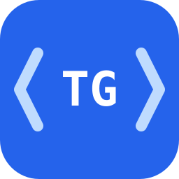

# TG Agent Plugin

[](https://github.com/KirillSidorenko/tg-agent-plugin/actions/workflows/ci.yml)



Unofficial local agent integration for Telegram, powered by
[`gotd/cli`](https://github.com/gotd/cli).

TG Agent Plugin is a thin integration and safety layer around the independent
open-source `gotd/cli` client. It does not implement the Telegram protocol,
ship its own Telegram client, or redistribute `tg` binaries.

The same source-only plugin gives Claude Code and Codex local skills for a
Telegram personal account. Credentials, configuration, and sessions stay in
the locations managed by `gotd/cli` on the user's device.

> [!IMPORTANT]
> This project is not affiliated with, endorsed by, or sponsored by Telegram.
> It supports personal accounts only. Bots, hosted sessions, remote MCP
> servers, and ChatGPT Web are outside its scope.

## Status

Version `0.3.0` is in pre-release validation. The public source repository,
cross-platform CI, Windows lifecycle harness, static analysis, and installation
from GitHub in both hosts are green. The first GitHub release remains blocked
until the outstanding physical OS and architecture checks are complete.

## Supported targets

| Host | macOS | Linux | Windows |
| --- | --- | --- | --- |
| Claude Code | amd64, arm64 | amd64, arm64 | amd64, arm64 |
| Codex | amd64, arm64 | amd64, arm64 | amd64, arm64 |

The initial plugin release pins `gotd/cli v0.11.0`. A newer upstream version is
never installed automatically; it must first pass compatibility and platform
tests in a new plugin release.

## Requirements

- A local Claude Code or Codex installation that supports plugins.
- Git access to <https://github.com/KirillSidorenko/tg-agent-plugin>.
- A Telegram personal account for local authorization.
- No administrator privileges.

For host details, see the official
[OpenAI plugin documentation](https://developers.openai.com/plugins/) and
[Claude Code marketplace documentation](https://code.claude.com/docs/en/discover-plugins).

## Install in Codex

During pre-release validation, add the reviewed public `main` branch, then
install the plugin:

```sh
codex plugin marketplace add KirillSidorenko/tg-agent-plugin --ref main
codex plugin add tg-agent-plugin@tg-agent
```

After release `0.3.0` is published, prefer immutable `--ref v0.3.0` instead of
`--ref main`.

Start a new task after installation so Codex loads the two bundled skills.

## Install in Claude Code

Add the GitHub marketplace, then install the same nested payload:

```sh
claude plugin marketplace add KirillSidorenko/tg-agent-plugin
claude plugin install tg-agent-plugin@tg-agent
```

Restart Claude Code after an install or update. The skills are namespaced by the
plugin in Claude Code.

See the exact install, update, and removal procedures in
[`docs/runbooks/install-and-uninstall.md`](docs/runbooks/install-and-uninstall.md).

## First local login

Ask the agent:

```text
Set up my local Telegram account for TG Agent.
```

The setup skill checks for `tg`, explains the pinned upstream download, and
asks before installing it. Phone login is the default; request QR explicitly
when preferred. Login opens in a separate local terminal process.

Never paste a phone number, Telegram code, QR token, or 2FA password into agent
chat. Enter every credential only in the separate local login window. When it
finishes, return to the agent and report completion; the setup skill verifies
authorization exactly once.

## Example requests

- “Show my latest Telegram chats and unread counts.”
- “Summarize the last 20 messages from `@username`.”
- “Find messages about the invoice in this chat.”
- “Send this text to `@username`.”
- “Download the image from message 12345 into the workspace.”
- “Wait up to five minutes for the next message from `@username`.”

An explicit write request authorizes only an unambiguous target. Destructive,
administrative, profile, and session-changing actions require confirmation of
the exact target and effect immediately before execution.

## Privacy and safety model

- `gotd/cli` owns Telegram protocol access, peer cache, configuration, and
  sessions. TG Agent Plugin is only a wrapper around that client.
- The plugin never reads, copies, exports, or deletes Telegram session files.
- Login credentials never belong in agent arguments, environment variables,
  redirected input, logs, fixtures, screenshots, or documentation.
- Downloads never overwrite an existing local file without confirmation.
- Uncertain writes are verified once and never repeated blindly.
- Realtime waiting is bounded and never becomes a background daemon.
- The plugin has no telemetry, hosted service, or separate data path.

## Updates

Plugin updates and upstream `tg` updates are independent. Refresh the host
marketplace and update or reinstall the plugin using the host commands in the
install runbook.

An explicit `check-update` may report a newer upstream release as
`newer-unpinned`. It cannot install that release. The install and repair actions
always use the version and checksums bundled with the installed plugin.

## Uninstall

Remove the plugin and marketplace with the host commands in the
[install and uninstall runbook](docs/runbooks/install-and-uninstall.md).
Uninstall preserves `gotd/cli` configuration and sessions by default, so
removing or reinstalling the plugin does not log out the Telegram account.

The runbook also documents a separate optional cleanup of the plugin-managed
`tg` executable and non-secret installation state. It deliberately provides no
automatic session cleanup.

## Troubleshooting

Start with [`docs/runbooks/troubleshooting.md`](docs/runbooks/troubleshooting.md).
Checksum, archive, smoke, or rollback failures must not be bypassed. Never post
credentials, session data, or private Telegram content in a bug report.

Report suspected vulnerabilities privately through
[`SECURITY.md`](SECURITY.md). Use the GitHub issue forms only for non-sensitive
bugs, platform failures, and upstream compatibility reports.

## Development

Requirements for contributors:

- Node.js 20 or newer for dependency-free tests.
- POSIX shell tooling on macOS and Linux.
- PowerShell on Windows.

Run the local suite with:

```sh
npm test
```

Run the Windows-native harness on Windows with:

```powershell
npm run test:windows
```

Every behavior change follows red/green TDD. See
[`CONTRIBUTING.md`](CONTRIBUTING.md), the
[`implementation plan`](docs/plans/2026-08-04-tg-agent-plugin-implementation.md),
and the [`architecture map`](docs/architecture/project-map.md).

## Upstream project and acknowledgements

This wrapper depends on the independent [`gotd/cli`](https://github.com/gotd/cli)
project. Its source, binaries, behavior, and Telegram protocol implementation
remain the responsibility of that upstream project. See its
[`releases`](https://github.com/gotd/cli/releases) and
[`MIT license`](https://github.com/gotd/cli/blob/main/LICENSE).

Thank you to Aleksandr Razumov
([`@ernado`](https://github.com/ernado)), the gotd maintainers, and every
`gotd/cli` contributor for building and maintaining the client this plugin
wraps.

See [`THIRD_PARTY_NOTICES.md`](THIRD_PARTY_NOTICES.md) for the complete
dependency and redistribution boundary.

## License

TG Agent Plugin source code and documentation are available under the
[`MIT License`](LICENSE). The independently distributed `gotd/cli` project has
its own copyright and license notices.
