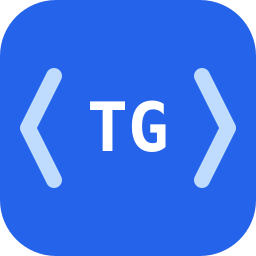

# TG Agent Plugin

[](https://github.com/KirillSidorenko/tg-agent-plugin/actions/workflows/ci.yml)



Connect Telegram to Claude Code, Codex, or a local Codex task in the ChatGPT
desktop app. The plugin installs the independent
[`gotd/cli`](https://github.com/gotd/cli) client, which your agent uses to read
chats, find messages, send replies, and work with files.

## Install with your agent

Open a local task in your app and paste this:

```text
Install TG Agent from https://github.com/KirillSidorenko/tg-agent-plugin
for this app, including its pinned Telegram CLI. I authorize installation
in my user account. Follow the repository's installation runbook, complete
setup, and open the secure local Telegram login. Keep login details out of chat.
```

Your agent handles installation and checks that the client is ready. You only
need to complete Telegram sign-in in the local window it opens. No administrator
privileges are required. If your app needs a new session to load the plugin,
the agent will tell you how to continue.

This requires a local agent with file and terminal access. It supports personal
accounts only; ChatGPT Web and bot accounts are outside its scope.

For agents and manual setup: follow the
[installation runbook](docs/runbooks/install-and-uninstall.md).

## First local login

Enter your login details only in the separate local window. Never paste a
phone number, Telegram code, QR token, or 2FA password into agent chat.
When sign-in finishes, tell the agent “Done” so it can verify the connection.

If installation finished in a previous task, start a new one and ask:

```text
Connect my Telegram account using TG Agent and open the local login window.
```

## Example requests

- “Show my latest Telegram chats and unread counts.”
- “Summarize the last 20 messages from `@username`.”
- “Find messages about the invoice in this chat.”
- “Send this text to `@username`.”
- “Download the image from message 12345 into the workspace.”
- “Wait up to five minutes for the next message from `@username`.”

An explicit write request authorizes only an unambiguous target. Destructive,
administrative, profile, and session-changing actions require confirmation of
the exact target and effect immediately before execution.

## Compatibility and project status

| Host | macOS | Linux | Windows |
| --- | --- | --- | --- |
| Claude Code | amd64, arm64 | amd64, arm64 | amd64, arm64 |
| Codex | amd64, arm64 | amd64, arm64 | amd64, arm64 |

The plugin pins `gotd/cli v0.11.0`. New CLI versions become installable after
compatibility and platform checks in a plugin release.

Version `0.3.0` is in pre-release validation and is installed from `main`.
Cross-platform CI and installation from GitHub in both hosts have passed.
The first tagged release awaits the remaining physical OS and architecture
checks described in the [platform checklist](docs/runbooks/manual-platform-tests.md).

TG Agent Plugin is a thin integration and safety layer around the independent
open-source `gotd/cli` client. It does not implement the Telegram protocol,
ship its own Telegram client, or redistribute `tg` binaries. It is not affiliated
with, endorsed by, or sponsored by Telegram. Hosted sessions and remote MCP
servers are outside its scope.

## Privacy and safety model

- `gotd/cli` owns Telegram protocol access, peer cache, configuration, and
  sessions. TG Agent Plugin is only a wrapper around that client.
- The plugin never reads, copies, exports, or deletes Telegram session files.
- Login credentials never belong in agent arguments, environment variables,
  redirected input, logs, fixtures, screenshots, or documentation.
- Downloads never overwrite an existing local file without confirmation.
- Uncertain writes are verified once and never repeated blindly.
- Realtime waiting is bounded and never becomes a background daemon.
- The plugin has no telemetry, hosted service, or separate data path.

## Updates

Plugin updates and upstream `tg` updates are independent. Refresh the host
marketplace and update or reinstall the plugin using the host commands in the
install runbook.

An explicit `check-update` may report a newer upstream release as
`newer-unpinned`. It cannot install that release. The install and repair actions
always use the version and checksums bundled with the installed plugin.

## Uninstall

Remove the plugin and marketplace with the host commands in the
[install and uninstall runbook](docs/runbooks/install-and-uninstall.md).
Uninstall preserves `gotd/cli` configuration and sessions by default, so
removing or reinstalling the plugin does not log out the Telegram account.

The runbook also documents a separate optional cleanup of the plugin-managed
`tg` executable and non-secret installation state. It deliberately provides no
automatic session cleanup.

## Troubleshooting

Start with [`docs/runbooks/troubleshooting.md`](docs/runbooks/troubleshooting.md).
Checksum, archive, smoke, or rollback failures must not be bypassed. Never post
credentials, session data, or private Telegram content in a bug report.

Report suspected vulnerabilities privately through
[`SECURITY.md`](SECURITY.md). Use the GitHub issue forms only for non-sensitive
bugs, platform failures, and upstream compatibility reports.

## Development

Requirements for contributors:

- Node.js 20 or newer for dependency-free tests.
- POSIX shell tooling on macOS and Linux.
- PowerShell on Windows.

Run the local suite with:

```sh
npm test
```

Run the Windows-native harness on Windows with:

```powershell
npm run test:windows
```

Every behavior change follows red/green TDD. See
[`CONTRIBUTING.md`](CONTRIBUTING.md), the
[`implementation plan`](docs/plans/2026-08-04-tg-agent-plugin-implementation.md),
and the [`architecture map`](docs/architecture/project-map.md).

## Upstream project and acknowledgements

This wrapper depends on the independent [`gotd/cli`](https://github.com/gotd/cli)
project. Its source, binaries, behavior, and Telegram protocol implementation
remain the responsibility of that upstream project. See its
[`releases`](https://github.com/gotd/cli/releases) and
[`MIT license`](https://github.com/gotd/cli/blob/main/LICENSE).

Thank you to Aleksandr Razumov
([`@ernado`](https://github.com/ernado)), the gotd maintainers, and every
`gotd/cli` contributor for building and maintaining the client this plugin
wraps.

See [`THIRD_PARTY_NOTICES.md`](THIRD_PARTY_NOTICES.md) for the complete
dependency and redistribution boundary.

## License

TG Agent Plugin source code and documentation are available under the
[`MIT License`](LICENSE). The independently distributed `gotd/cli` project has
its own copyright and license notices.
