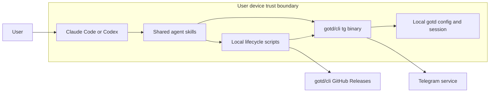

# TG Agent Plugin Project Map

## Purpose and source priority

This is the mandatory architecture overview for `tg-agent-plugin`. Read it before any project work, then follow the task router below. It describes stable system boundaries and current-versus-planned topology; the approved behavior contract belongs in the linked design specification.

Source priority:

1. Project-root `AGENTS.md` for non-negotiable working and security rules.
2. This overview for system topology, component ownership, and trust boundaries.
3. The design specification for product behavior and acceptance criteria.
4. Fresh code, tests, and runtime evidence once implementation exists.

## Current system snapshot

The public source repository is in pre-release validation. Its dependency-free test harnesses, English documentation and runbooks, issue routing, shared nested plugin payload, host manifests, repository marketplaces, brand asset, pinned upstream compatibility manifest, cross-platform lifecycle scripts, platform authorization launchers, shared operational/setup skills, CI/release workflows, source scanner, upstream verifier, plugin validator, and deterministic source-only packager exist. GitHub-hosted CI is green across Ubuntu, macOS, and Windows, including the native Windows harness and static analyzers. Both hosts have installed the plugin from the public GitHub marketplace and discovered the shared skills. No public GitHub release exists yet.

The planned product is one source repository that distributes the same local plugin payload to Claude Code and Codex. The payload teaches the host agent to use an independently installed `tg` binary and provides safe lifecycle scripts for installation, authorization, repair, and compatibility-pinned updates.



## Components and responsibilities

| Component | Responsibility |
| --- | --- |
| Claude Code manifest and marketplace | Make the shared payload installable from a GitHub-backed Claude Code marketplace. |
| Codex manifest and marketplace | Make the same payload installable from a GitHub-backed Codex marketplace. |
| `telegram` skill | Route ordinary read, search, send, media, and bounded realtime requests directly to `tg` with safety gates. |
| `telegram-setup` skill | Route missing installation, local authorization, repair, and explicit update checks. |
| POSIX lifecycle scripts | Implement macOS and Linux installation, verification, login launch, state, and rollback. |
| PowerShell lifecycle scripts | Implement the equivalent Windows lifecycle behavior. |
| Pinned release manifest | Own the tested upstream `tg` version, supported assets, architectures, and SHA-256 values. |
| Tests and CI | Enforce manifests, security invariants, archive safety, rollback, platform behavior, and documentation quality. |

## Trust and security boundaries

- Telegram credentials and sessions remain on the user's device in locations owned by `gotd/cli`. The plugin never reads or copies session contents.
- Login secrets are entered only into a separate local interactive `tg` process. They must not cross into agent chat, tool arguments, environment variables, plugin state, logs, tests, or documentation.
- The lifecycle scripts may download only pinned release assets from `github.com/gotd/cli`. Downloads are untrusted until checksums and archive structure pass validation.
- Claude Code and Codex are instruction hosts, not Telegram data stores. They receive only the message data needed to fulfill the user's request through normal `tg` command output.
- Telegram is an external service boundary. The project is unofficial and must not claim endorsement or use the official Telegram logo.
- Write operations affect an external account. Ambiguous recipients require clarification, and destructive/admin/session operations require immediate confirmation.

## Key flows

### Installation and authorization

The setup skill checks for `tg`, obtains explicit installation consent when missing, invokes the platform lifecycle script, downloads the pinned upstream asset, validates it, installs without administrator privileges, and runs contract smoke tests. Authorization then opens a separate local interactive process. The agent verifies completion once with `tg whoami -o json` after the user reports that login is complete.

### Ordinary Telegram work

The Telegram skill resolves the installed binary and invokes it directly. Parsed operations request JSON output, reuse broad results locally, and avoid repeated preflight calls. Read operations proceed without extra confirmation. Writes require explicit user intent and an unambiguous target. Destructive operations stop for confirmation immediately before execution.

### Release and update

Plugin releases are source-only and use semantic versioning. Each release pins one tested upstream `tg` version and asset set. An explicit update check may report a newer upstream release but cannot install an untested version. Updating `tg` requires a plugin release with an updated compatibility manifest and successful platform tests.

## Architectural invariants

- One shared skills and scripts payload serves both Claude Code and Codex.
- No hosted MCP server, daemon, telemetry service, bot integration, or remote Telegram session exists.
- No `tg` binary is committed to or attached to this project's releases.
- Installation never requires administrator privileges.
- Upstream compatibility is pinned, verified, and release-controlled.
- Telegram configuration and sessions survive plugin repair, update, disablement, and uninstall.
- Public documentation is English and credits `gotd/cli`, Aleksandr Razumov (`@ernado`), the gotd maintainers, and contributors.

## Repository map

Current files:

```text
.
├── .gitignore
├── .agents/plugins/marketplace.json
├── .claude-plugin/marketplace.json
├── .github/ISSUE_TEMPLATE/
├── .github/workflows/{ci.yml,release.yml}
├── AGENTS.md
├── CHANGELOG.md
├── CONTRIBUTING.md
├── LICENSE
├── README.md
├── SECURITY.md
├── THIRD_PARTY_NOTICES.md
├── package.json
├── scripts/{package-plugin.mjs,scan-source.mjs,validate_plugin.py,verify-upstream-release.mjs}
├── plugins/tg-agent-plugin/
│   ├── .claude-plugin/plugin.json
│   ├── .codex-plugin/plugin.json
│   ├── assets/tg-agent-mark.svg
│   ├── config/release-manifest.json
│   ├── scripts/
│       ├── tg-login-linux.sh
│       ├── tg-login-macos.sh
│       ├── tg-login-windows.ps1
│       ├── tg-tool.ps1
│       └── tg-tool.sh
│   └── skills/
│       ├── telegram/{SKILL.md,agents/,references/}
│       └── telegram-setup/{SKILL.md,agents/,references/}
├── tests/authorization-launchers.test.sh
├── tests/authorization-static.test.mjs
├── tests/ci.test.mjs
├── tests/documentation.test.mjs
├── tests/manifest.test.mjs
├── tests/package.test.mjs
├── tests/plugin-validator.test.mjs
├── tests/posix-lifecycle.test.sh
├── tests/release-manifest.test.mjs
├── tests/repository-contract.test.mjs
├── tests/security-scan.test.mjs
├── tests/skills.test.mjs
├── tests/upstream-verifier.test.mjs
├── tests/windows-lifecycle-static.test.mjs
├── tests/windows-lifecycle.Tests.ps1
└── docs/
    ├── architecture/project-map.md
    ├── plans/2026-08-04-tg-agent-plugin-implementation.md
    ├── releases/0.3.0.md
    ├── runbooks/
    │   ├── install-and-uninstall.md
    │   ├── manual-platform-tests.md
    │   ├── release.md
    │   ├── troubleshooting.md
    │   └── upstream-release-verification.md
    └── specs/2026-08-04-tg-agent-plugin-design.md
```

The remaining planned implementation layout is owned by the design specification and must not be treated as current until those files exist.

## Task router

| Task | Read after this overview | Optional source |
| --- | --- | --- |
| Product behavior, scope, safety, or acceptance criteria | [`../specs/2026-08-04-tg-agent-plugin-design.md`](../specs/2026-08-04-tg-agent-plugin-design.md) | Official host or upstream documentation linked from the design |
| Initial implementation planning | [`../specs/2026-08-04-tg-agent-plugin-design.md`](../specs/2026-08-04-tg-agent-plugin-design.md) | Fresh Claude Code, Codex, `gotd/cli`, and Telegram documentation |
| Implementation status, sequencing, or test gates | [`../plans/2026-08-04-tg-agent-plugin-implementation.md`](../plans/2026-08-04-tg-agent-plugin-implementation.md) | Fresh Git and CI evidence after implementation begins |
| Host install, update, or uninstall | [`../runbooks/install-and-uninstall.md`](../runbooks/install-and-uninstall.md) | Current host CLI help and public repository state |
| Installation, authorization, or host diagnosis | [`../runbooks/troubleshooting.md`](../runbooks/troubleshooting.md) | Bundled skill troubleshooting references |
| Upstream version, release asset, or checksum changes | [`../runbooks/upstream-release-verification.md`](../runbooks/upstream-release-verification.md) | Official `gotd/cli` release and GitHub API metadata |
| Release or manual platform validation | [`../runbooks/release.md`](../runbooks/release.md) + [`../runbooks/manual-platform-tests.md`](../runbooks/manual-platform-tests.md) | Implementation plan evidence and fresh CI/GitHub state |
| Architecture review | [`../specs/2026-08-04-tg-agent-plugin-design.md`](../specs/2026-08-04-tg-agent-plugin-design.md) | Fresh repository and test evidence |

Add physically separate application, delivery, security, or runbook documents only when implementation creates enough detail to justify a canonical owner. Update this router in the same change.

## Critical current gaps

- The required manual matrix remains incomplete outside macOS arm64; Linux, Windows, and macOS amd64 executable evidence is outstanding.
- The deterministic package has local and hosted CI evidence, but no source-only release exists.

## Ownership and updates

The repository maintainer owns this overview. Update it only when system components, responsibilities, interfaces, flows, storage, delivery topology, or trust boundaries change. Project status, exact commands, test run output, and release evidence belong in their dedicated documents rather than this overview.
